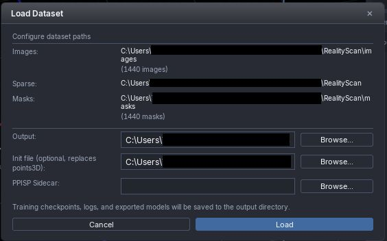
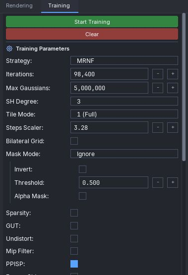

# 360° Image Gaussian Splatting with Metashape

## Introduction

Gaussian Splatting is gaining attention as a method for recreating wide outdoor scenes in 3D. While related information is increasingly appearing on social media and blogs, it is scattered across many sources, making it difficult to build an efficient workflow.

In the previous articles — [Basic Workflow](../Basic/article-EN.md) and [Quality Improvement Edition](../Advanced/article-EN.md) — I introduced a workflow built entirely around free-to-use tools that I personally use for Gaussian Splatting as a hobby. This time, I'll introduce a workflow using **Metashape (Standard Eddition)**, a relatively popular paid SfM tool, along with additional post-processing steps.

> **💡 Before You Start**  
> This article includes a step that involves running a Python script. If you're new to Gaussian Splatting or unfamiliar with Python, I recommend working through the free-tools-based [Basic Workflow](../Basic/article-EN.md) first to understand the overall process before tackling this one.

> **📝 Note**  
> This article is written so it can be followed independently, so some sections overlap with the previous articles. Please keep this in mind.

---

## Environment

### PC Specs

| Item | Spec |
|------|------|
| OS | Windows 11 |
| GPU | NVIDIA GeForce RTX 4070 SUPER |
| CPU | AMD Ryzen7 8700G |
| RAM | 32 GB |

### 360° Camera

- **Insta360 X4 Air**  
  ※ Other manufacturers' cameras such as THETA are also supported. **8K or higher** is recommended.

### Software

| Software | Purpose |
|----------|---------|
| [LichtFeld Studio v0.5.1](https://lichtfeld.io/) | GUI tool for 3D Gaussian Splatting |
| [360° Gaussian v1.3.0](https://laskosvirtuals.gumroad.com/l/360gaussian) | Tool to automate each step of Gaussian Splatting |
| [Metashape (Standard Eddition)](https://oakcorp.net/agisoft/standard/) | Used for SfM and point cloud generation |
| [RealityScan](https://www.realityscan.com/) | Used for point cloud regeneration |
| [360-to-RealityScan](https://github.com/TakashiYoshinaga/360-to-RealityScan) | Converts Metashape results into a format readable by RealityScan (.xmp) |

### Other

- **Python environment** (for 360-to-RealityScan)  
  e.g., Anaconda

---

## Overall Workflow

Gaussian Splatting generally follows these steps:

| # | Process | Description |
|---|---------|-------------|
| 1 | **Capture** | Shoot the scene with a 360° camera |
| 2 | **SfM** (Structure from Motion) | Estimate the position from which each image was taken |
| 3 | **Point Cloud Generation** | Generate a point cloud based on the camera positions from SfM |
| 4 | **Gaussian Splatting** | Generate a 3D Gaussian Splatting model from the point cloud |

In this article, **Metashape** is used for Steps 2 and 3.  
Additionally, before Step 4, the Metashape results are converted into a format readable by integration tools such as LichtFeld Studio or RealityCapture, and point cloud regeneration is performed.

---

## Step 1. Capturing & Exporting the Video

Capture the scene with your 360° camera. Since processing can take a long time, it's recommended to start with **videos under 1 minute** until you get familiar with the workflow.

Export the captured video in **Equirectangular format** and copy it to your PC.  
If you're using an Insta360, export it using **Insta360 Studio** (the PC application).

> **⚠️ Prerequisites**  
> This article assumes that the 360° camera is held **nearly vertical** during shooting.

> **⚠️ Note on Stabilization**  
> Stabilization can be ON or OFF, but if you turn it **ON**, make sure to disable the following:
> - Horizon Leveling
> - Tilt Recovery
> - Vibration Reduction

> **💡 Tip**  
> With stabilization ON, the camera automatically corrects for tilt. Strictly speaking, the slight distortion introduced by this correction can become a source of noise in later processing — but if you just want to get started without worrying about that, turning stabilization ON is totally fine.


---

## Step 2. SfM and Point Cloud Generation

This step uses **360° Gaussian**.  
Because 360° Gaussian supports multiple tools for both SfM and Gaussian Splatting, it makes it easy to compare and test different combinations of tools and methods.  
For detailed usage, refer to the following videos:

- 📺 [Basic Tutorial](https://www.youtube.com/watch?v=XcmmxKbjESQ)  
- 📺 [Additional Features Tutorial](https://www.youtube.com/watch?v=FDEUAn8FjSk)

### 2.1 Image Extraction

1.　Launch **360° Gaussian**  
2.　Click **Add Video(s)** and select the Equirectangular video  
3.　Select **Splitting** and configure the extraction settings  

| Parameter | Description |
|-----------|-------------|
| Extra frame every | Extract images at the specified interval (seconds or frames) |
| Sharp frame extraction | Whether to prioritize less blurry images compared to adjacent frames |
| Sharpness check range | E.g., `10` compares ±5 frames to select the sharpest image |


### 2.2 Image Masking (Optional)

**AutoMasker** is a tool that automatically masks regions that are unnecessary for Gaussian Splatting.

1.　Click **AutoMasker**  
2.　Enable **Use AutoMasker**  
3.　Enter keywords in **Detection Keywords** separated by periods (`.`)  
   Example: `person.sky`


> **💡 Two Reasons Why Masking Matters**  
> First, subjects that move or lack distinct features — such as people, vehicles, and low-texture objects — introduce **noise into the SfM process**, reducing the accuracy of camera pose estimation. Since SfM accuracy directly impacts the quality of the Gaussian Splatting output, masking these subjects out is essential.  
> Second, **the same noise degrades quality during the training stage as well**. When the same subject appears with a different appearance across frames, the Gaussians struggle to converge to the correct shape and color. Masking protects quality at both stages of the pipeline.  
> 📺 [Reference Video](https://youtu.be/XcmmxKbjESQ?si=wPF74IBWmgV6mpxk&t=59)

> **📝 About AutoMasker**  
> AutoMasker is a paid tool (46€), but since it runs as a standalone application, it can be used not only within the 360° Gaussian Splatting automation workflow, but also for general 360° image masking tasks outside of Gaussian Splatting.  
> It offers better value than purchasing a similar tool, and is well worth considering.  
> For setup instructions to integrate it with 360° Gaussian after purchase, refer to [this video](https://youtu.be/9g8wO_8jdKs?si=wNln9pvP2_7A2DSE&t=99).

### 2.3 SfM Configuration

1.　Click **Alignment**  
2.　Configure **Training Method**  

Since this article uses LichtFeld Studio for the final processing, configure the settings as follows:
- **Training Method**: `Lichtfeld`
- **SfM (dropdown menu)**: `Metashape Standard GUT`

> **⚠️ Difference from Previous Articles**  
> The previous articles used `SphereSFM`-based SfM tools, but this article uses **`Metashape Standard GUT`**. Please make sure to select the correct one.


### 2.4 Frame Extraction

Click **Start** to extract frames at the interval configured earlier.  
When extraction is complete, a screen explaining the Metashape alignment workflow will appear. It serves as a useful reference, so there is no need to close it yet.


Verify that the camera positions and point cloud have been generated correctly.

```
📁 Folder containing the video
  └── 📁 Folder with the same name as the video
       ├── 📁 final
       ├── 📁 frames
       ├── 📁 lichtfeld
       ├── 📁 masks
       └── 📁 metashape
```

In preparation for the next step, create a **`RealityScan`** folder at the same level as the **`lichtfeld`** folder.

```
📁 Folder containing the video
  └── 📁 Folder with the same name as the video
       ├── 📁 final
       ├── 📁 frames
       ├── 📁 lichtfeld
       ├── 📁 masks
       ├── 📁 metashape
       └── 📁 RealityScan　← folder you just created
```

### 2.5 Importing Data into Metashape

1.　Launch **Metashape**  
2.　Click **Workflow** in the menu bar and select **Add Folder**  
3.　Select the **`frames`** folder inside the folder generated earlier  
4.　Click **Tools** in the menu bar and select **Camera Calibration**  
5.　Open the **General** tab and change **Camera type** to `Spherical`  
6.　Click **OK**  

> **⚠️ Important Setting**  
> If you forget to change Camera type to `Spherical`, the 360° images will not be processed correctly. Make sure to set this.


**[Optional: If You Created Mask Images]**

If you generated mask images, import them using the following steps:

1.　Click **File** in the menu bar and select **Import → Import Masks**  
2.　Change **File name template** to `{filename}.mask.png`  
3.　Click **OK** and select the **`masks`** folder inside the folder generated earlier  

> **📝 Note on Template Format**  
> The default may show something like `{filename}_mask.png`. Make sure to change the underscore (`_`) to a period (`.`).


### 2.6 Running SfM

1.　Click **Workflow** in the menu bar and select **Align Photos**  
2.　When the settings dialog appears, configure the options and click **OK**  

> **💡 About Alignment Settings**  
> The author uses `Estimated` rather than `Sequential` for the Reference preselection method. For other detailed settings, refer to the screenshot below.


When processing is complete, the results will be displayed. Verify that the camera positions and point cloud have been estimated correctly.


**[Exporting Data]**

If everything looks correct, save the generated data.

1.　Click **File** in the menu bar and select **Export → Export Cameras**  
2.　Select the **`metashape`** folder and save as an XML file with any name (e.g., `metashape.xml`)  
3.　Next, select **File → Export → Export Point Cloud**  
4.　Save to the same **`metashape`** folder as a PLY file with any name (e.g., `points.ply`)  
5.　When the **Export Points** dialog appears, verify the settings and click **OK**  


Once the export is complete, close Metashape.  
In this article, the processing on the 360° Gaussian side is also complete at this point — click **Abort** in the Metashape usage guide window to close it.  
Also click **Stop** in the main 360° Gaussian window to end processing.

---

## Step 3. Image Splitting and Point Cloud Regeneration

In this step, the SfM results obtained from Metashape are split into images from multiple viewpoints using a pinhole camera model. The data is then imported into RealityScan, which performs point cloud regeneration based on the split images.

### 3.1 Input/Output File Configuration

1.　Open a terminal (Python environment) and run the following command to launch **`metashape_to_realityscan.py`**:

```bash
cd C:\path\to\360-to-RealityScan
python metashape_to_realityscan.py
```

> **📝 Note**  
> For instructions on how to obtain the Python script and set up the environment, refer to the README in the repository below.  
> https://github.com/TakashiYoshinaga/360-to-RealityScan

2.　Specify each path as follows:  

| Item | Target |
|------|--------|
| Metashape XML | `metashape.xml` inside the `metashape` folder |
| PLY file (optional) | `points.ply` inside the `metashape` folder |
| Input folder (equirectangular) | `frames` folder |
| Mask folder (equirectangular, optional) | `masks` folder |
| Output folder | the `RealityScan` folder you created |

### 3.2 Split Settings

The default settings are generally fine.

| Parameter | Description |
|-----------|-------------|
| Pitch Angles | Setting to `0` extracts only the vertically centered region of the Equirectangular image |
| Overlap Rate | Overlap ratio between images. Default is fine; setting to `0` extracts only the side faces of the Cube Map |

> **💡 Note on Pitch Angles**  
> There's no need to limit extraction to the horizontal direction only. Depending on the scene, adding upward and downward views can improve the quality of the Gaussian Splatting output. For example, if the floor or ceiling has distinctive textures or patterns, try a setting like `-30,0,30` to include tilted angles.

### 3.3 Running the Conversion

Click **Start Conversion** to start the conversion.  
When complete, you'll see the following screen:


The SfM results are now ready to be imported into RealityScan.

> **📝 Note**  
> If you specify both the XML and PLY files, the output will include complete COLMAP-format data containing camera poses, a point cloud, and image information.  
> If you prefer to skip point cloud regeneration in RealityScan and use the images split by this tool directly for Gaussian Splatting, proceed to **Step 4. Gaussian Splatting**.

### 3.4 Point Cloud Generation in RealityScan

1.　Launch **RealityScan**  
2.　Click the **WORKFLOW** tab  
3.　Click **Folder** and select the **`all`** folder inside the `RealityScan` folder  
4.　Open **Inputs** and press `Ctrl + A` to select all images  


5.　Configure the detail settings as follows:  

| Category | Item | Value |
|----------|------|-------|
| **Prior pose** | Absolute pose | `Locked` |
| **Prior calibration** | Calibration group | `0` (same settings for all cameras) |
| | Prior | `Fixed` (fixed field of view) |
| **Prior lens distortion** | Lens group | `0` (same settings for all cameras) |
| | Prior | `Fixed` (fixed distortion) |


6.　Click the **ALIGNMENT** tab  
7.　Click **Align Images**  


When processing is complete, the regenerated point cloud will be displayed.


### 3.5 Export

**[Export Camera Pose Information and Point Cloud in COLMAP Format]**

1.　Click **Export**  
2.　Click **COLMAP Text Format**  
3.　Save to the `RealityScan` folder with any file name (e.g., `colmap`)  

> **📝 Note on File Overwriting**  
> The `cameras.txt`, `images.txt`, and `points3D.txt` output by `metashape_to_realityscan.py` will be overwritten. This is fine, but if you want to keep the COLMAP files from before regeneration, move them to a separate folder beforehand.

4.　In the **Export Dialog**, set **Export images** to `No`  
5.　Open **Export transformation settings → Scene transformation** and set the Rotation as follows:  

| Item | Value |
|------|-------|
| Rotate X | `0°` |
| Rotate Y | `0°` |
| Rotate Z | `0°` |

6.　Click **OK**  


---

## Step 4. Gaussian Splatting

### 4.1 Loading Data

1.　Launch **LichtFeld Studio**  
2.　Drag and drop the **`RealityScan`** folder (directly under the video name folder) into the window  
3.　When the **Load DataSet** dialog appears, select `pointcloud.ply` from the `RealityScan` folder for **Init file**  
   ※ If you skipped point cloud regeneration in RealityScan, you can leave **Init file** blank  
4.　Click **Load**  




Verify that the point cloud and images have been loaded correctly.  
If you don't need to see the camera images, uncheck **Camera Frustum** in the **Rendering** tab on the right side of the screen.


### 4.2 Training Configuration

Here is an example training configuration. Feel free to experiment with different settings as you get more familiar.

1.　Click the **Training** tab  
2.　Select `MRNF` for **Strategy**  
3.　Set **Steps Scaler** appropriately  

| Condition | Recommended Value |
|-----------|------------------|
| 300 or fewer images | `1` |
| More than 300 images | `number of images / 300` |

> **⚠️ If Training Doesn't Work**  
> If the Gaussian Splatting training fails to converge and the view whites out as steps progress, setting Steps Scaler to **2–3x** the value of `number of images / 300` tends to stabilize training.  
> In the author's experience, it's also common practice to start training with a value around **1.5–2x** the recommended value from the beginning.

4.　Set **Max Gaussians** for the maximum number of Gaussians  
   The default value is generally fine, but increase it if the output lacks detail.

**Optional Settings:**  
Only apply the following if you created mask images with AutoMasker.
- **Mask Mode** → Set to `Ignore`
- **Use Alpha as Mask** → Uncheck



For other parameters, start with the above settings and experiment as you become more comfortable.

### 4.3 Running Training

1.　Use the mouse to zoom in on the area you want to observe during training  
   (In my example, around a bridge)  
2.　Click **Start Training** to begin  
3.　The display starts blurry but gradually becomes clearer as steps progress  


Training stops automatically when the step limit is reached.  
If you want to save intermediate results, click **Save Checkpoint**.

### 4.4 Export

The exported data can be used with tools like [SuperSplat Editor](https://superspl.at/editor) for creating videos or viewing in a viewer.

1.　Click **File → Export**  
2.　Select the output format (e.g., `.ply`)  

---

## Summary

In this article, I introduced a workflow using **Metashape**, a commercial SfM software.  
Metashape is a paid tool, but it comes with a 30-day free trial, so feel free to give it a try if you're interested.

**SphereSfM**, covered in previous articles, offers significantly more fine-grained parameter control for SfM (such as alignment iterations). On the other hand, **Metashape** provides an easy-to-use windowed interface, giving it an edge in terms of handiness and processing speed. It's difficult to say definitively which is superior — the best choice depends on your use case, goals, and the level of accuracy you need.

In that regard, **360° Gaussian** makes it easy to switch between processing tools within the same application to suit your needs. I find it to be an extremely powerful tool for comparing and evaluating different methods.

I hope you'll use this article's workflow as a foundation, add your own personal touches, and push the quality of your Gaussian Splatting results even further.

### Examples (Comparison)

For reference, here is a comparison of the results generated using different SfM tools. You can view the actual 3D scenes in your browser:

- **[Processed with SphereSfM (Previous Article)](https://superspl.at/scene/c28be98f)**
- **[Processed with Metashape (This Article)](https://superspl.at/scene/adaae718)**

<br>


